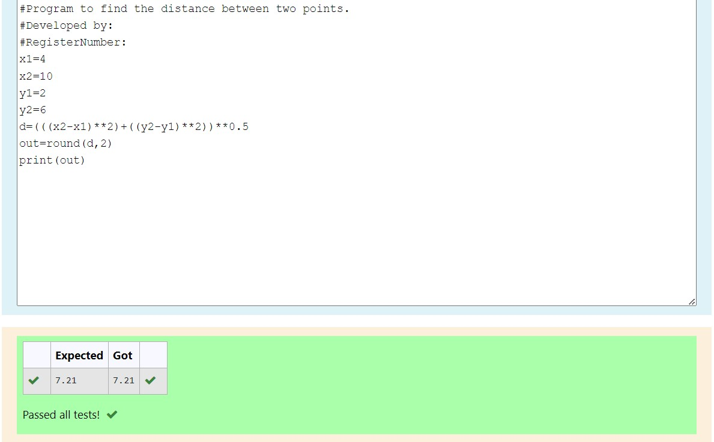

# DISTANCE-BETWEEN-TWO-POINTS

## AIM:
To write a python program to find the distance two 2 points
## ALGORITHM:
### Step 1: 
### Step 2: 
### Step 3: 
Substitute the values in the distance formula  
### Step 4: 
### Step 5: 
### PROGRAM:
#Program to find the distance between two points.
#Developed by: 
#RegisterNumber:
x1=4
x2=10
y1=2
y2=6
d=(((x2-x1)**2)+((y2-y1)**2))**0.5
out=round(d,2)
print(out)

### OUTPUT:

### RESULT:
Exp completed